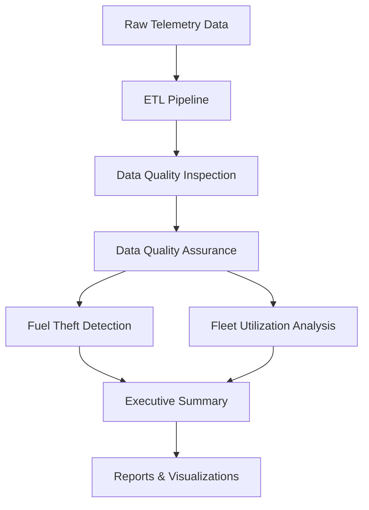

# AutoAnalyti𝕏  - Advance Fleet Analytics Platform

[](https://www.python.org/downloads/)
[](https://opensource.org/licenses/MIT)

> **Enterprise-grade fleet analytics solution for telematics data analysis, fuel theft detection, and fleet utilization optimization.**

AutoAnalytiX is a comprehensive Python-based analytics platform that transforms raw vehicle telematics data into actionable business intelligence. The system provides automated data quality inspection, fuel theft detection, and fleet utilization analysis with professional reporting and visualizations.

## 🎯 Key Features

### 🔍 **Advanced Data Quality Analysis**
- **Multi-sensor validation** across speed, odometer, and fuel level data
- **Automated anomaly detection** with physics-based validation thresholds
- **Moving average analysis** for odometer reset classification
- **Range violation detection** for fuel level data (0-100% validation)

### 🚨 **Fuel Theft Detection**
- **Cross-sensor validation** using synchronized 10-minute time windows
- **Real-time MPG calculations** with efficiency ratio analysis
- **Threat level classification** (CRITICAL, HIGH, MEDIUM, LOW)
- **Financial impact estimation** with theft value calculations

### 💰 **Fleet Utilization Optimization**
- **Idle period detection** (>5 minutes) with cost analysis
- **Utilization scoring** with efficiency grading (EXCELLENT to POOR)
- **Cost breakdown** ($34/hour idle cost formula: $4 fuel + $30 operational)
- **Savings projections** with 25%, 50%, and 75% reduction scenarios

### 📊 **Professional Reporting**
- **Executive summary** with total financial impact analysis
- **Individual vehicle reports** with detailed violation logging
- **High-quality visualizations** (PDF plots with 300 DPI)
- **CSV data exports** for further analysis

## 🚀 Quick Start

### One-Line Installation & Execution

```bash
python setup.py
```

That's it! This single command will:
1. [OK] Create a virtual environment
2. [OK] Install all dependencies  
3. [OK] Run the complete analysis
4. [OK] Generate comprehensive reports

### Manual Setup (Alternative)

```bash
# Clone the repository
git clone https://github.com/ps-research/AutoAnalytiX.git
cd AutoAnalytiX

# Create virtual environment
python -m venv autoanalytix_venv

# Activate virtual environment
# Windows:
autoanalytix_venv\Scripts\activate
# macOS/Linux:
source autoanalytix_venv/bin/activate

# Install dependencies
pip install -r requirements.txt

# Run analysis
python main.py
```

## 📁 Data Requirements

Place your telemetry data files in the `data/` directory:

```
data/
├── telemetry_1.csv     # Wide-format telemetry (vehicle_id, timestamp, speed, odometer, fuel_level)
├── telemetry_2.csv     # Long-format telemetry (vehicle_id, timestamp, name, val)
└── vehicle_data.csv    # Vehicle metadata (id, tank_capacity, rated_mpg)
```

### Sample Data Format

**telemetry_1.csv (Wide Format):**
```csv
vehicle_id,timestamp,speed,odometer,fuel_level
VEH001,2024-01-01 08:00:00,0,50000,85.5
VEH001,2024-01-01 08:05:00,35,50002,85.2
```

**telemetry_2.csv (Long Format):**
```csv
vehicle_id,timestamp,name,val
VEH001,2024-01-01 08:00:00,speed,0
VEH001,2024-01-01 08:00:00,fuel_level,85.5
```

**vehicle_data.csv (Metadata):**
```csv
id,tank_capacity,rated_mpg
VEH001,50,8.5
VEH002,60,7.2
```

## 📊 Output Structure

After analysis, comprehensive reports are generated in `AutoAnalytiX__Reports/`:

```
AutoAnalytiX__Reports/
├── 📋 Executive_Summary.txt           # Business intelligence summary
├── 📁 Logs/                          # System operation logs
├── 🚨 Theft_Detection/               # Fuel theft event reports
├── 💰 Utilization_Analysis/          # Fleet utilization data
├── 📈 Plots/                         # High-quality visualizations
│   ├── Speed_Quality/                # Speed analysis plots
│   ├── Odometer_Quality/             # Odometer analysis plots  
│   ├── Fuel_Quality/                 # Fuel analysis plots
│   ├── Theft_Analysis/               # Theft detection plots
│   └── Utilization/                  # Utilization analysis plots
├── 📊 Data_Exports/                  # CSV exports and summaries
├── 🧹 Cleaned_Data_Exports/          # Quality-assured data
└── 📝 Quality_Reports/               # Data quality assessments
```

## 🏗️ Architecture

### Modular Design

AutoAnalytiX follows a professional modular architecture:

```
AutoAnalytiX/
├── 🚀 setup.py                      # One-liner automation
├── 📋 main.py                       # Application orchestrator  
├── 📦 requirements.txt              # Dependencies
├── 🔧 core/                         # Core logging infrastructure
├── 🛠️ shared/                       # Common utilities
├── ⚙️ config/                       # Configuration settings
├── 📥 Module-1_ETL/                 # Data extraction & transformation
├── 🔍 Module-2_DataQualityInspection/ # Quality analysis
├── 🧹 Module-3_DataQualityAssurance/  # Data cleaning
├── 🚨 Module-4A_FuelTheftDetection/   # Theft detection
├── 💰 Module-4B_FleetUtilization/     # Utilization analysis
├── 📊 reports/                      # Executive reporting
└── 📁 data/                         # Input data directory
```

### Processing Pipeline



## 🔧 Technical Specifications

### System Requirements
- **Python:** 3.8 or higher
- **Memory:** 4GB RAM minimum (8GB recommended)
- **Storage:** 2GB free space for reports and plots
- **Platform:** Windows, macOS, Linux

### Key Dependencies
- **pandas** ≥1.5.0 - Data manipulation and analysis
- **numpy** ≥1.21.0 - Numerical computing
- **matplotlib** ≥3.5.0 - Plotting and visualization
- **seaborn** ≥0.11.0 - Statistical visualizations
- **scipy** ≥1.9.0 - Scientific computing
- **python-dateutil** ≥2.8.0 - Date parsing
- **tqdm** ≥4.64.0 - Progress tracking

### Performance Characteristics
- **Processing Speed:** ~1,000 records/second per vehicle
- **Memory Usage:** ~100MB per 10,000 telemetry records
- **Scalability:** Tested with 100+ vehicles, 1M+ data points
- **Output Generation:** ~50 files per vehicle analyzed

## 📈 Business Intelligence Features

### Financial Impact Analysis
- **Total cost quantification** across theft and utilization
- **ROI calculations** for optimization programs
- **Savings projections** with multiple scenarios

### Risk Assessment
- **Threat level classification** for fuel theft events
- **Investigation priority** ranking (1=High, 3=Low)
- **Data quality scoring** for reliability assessment

### Operational Insights
- **Fleet utilization percentages** with efficiency grading
- **Idle cost breakdowns** (fuel waste vs operational cost)
- **Vehicle-specific violation** tracking and logging

## 🎛️ Configuration

Key settings can be modified in `config/settings.py`:

```python
# Cost Configuration
COST_CONFIG = {
    'idle_cost_per_hour': 34.00,    # Total idle cost
    'fuel_waste_rate': 4.00,        # Fuel cost component
    'operational_rate': 30.00,      # Operational cost component
    'fuel_price_per_gallon': 5.00   # For theft value estimation
}

# Threshold Configuration  
THRESHOLD_CONFIG = {
    'acceleration_thresholds': [10, 20, 30, 40, 50, 75, 100],  # mph/min
    'minimum_idle_duration_minutes': 5,    # Idle detection threshold
    'mpg_theft_investigation_threshold': 2  # MPG below this = investigate
}
```

## 🚨 Alert System

### Violation Types
- **HIGH_ACCELERATION:** Excessive acceleration events (>50 mph/min)
- **ODOMETER_ANOMALY:** Zero readings and faulty sensor data
- **FUEL_RANGE_VIOLATION:** Impossible fuel levels (<0% or >100%)
- **FUEL_THEFT_DETECTED:** Potential theft with efficiency analysis
- **EXCESSIVE_IDLE_COST:** High idle costs (>$100)

### Investigation Priorities
1. **Priority 1 (CRITICAL/HIGH):** Immediate investigation required
2. **Priority 2 (MEDIUM):** Review within 24 hours  
3. **Priority 3 (LOW):** Weekly review acceptable

## 🔬 Advanced Analytics

### Physics-Based Validation
- **Speed acceleration limits:** 50 mph/min threshold for violations
- **MPG sensor error detection:** >50 MPG flagged as sensor malfunction
- **Fuel consumption validation:** Cross-reference with distance traveled

### Machine Learning Features
- **Moving average analysis** for trend detection
- **Efficiency ratio calculations** for theft detection
- **Statistical outlier identification** using IQR and Z-score methods

## 📚 Module Documentation

### Module-1_ETL
**Purpose:** Extract, transform, and load telemetry data from multiple sources
- `data_loader.py` - Raw data ingestion with validation
- `timestamp_processor.py` - Timestamp standardization
- `stream1_extractor.py` - Wide-format data processing
- `stream2_extractor.py` - Long-format parameter-value processing
- `data_merger.py` - Intelligent stream merging with deduplication

### Module-2_DataQualityInspection  
**Purpose:** Comprehensive data quality analysis and anomaly detection
- `speed_analyzer.py` - Acceleration pattern analysis
- `odometer_analyzer.py` - Reset detection with moving averages
- `fuel_analyzer.py` - Range violation and trend analysis
- `*_plotter.py` - Professional visualization generation

### Module-3_DataQualityAssurance
**Purpose:** Systematic data cleaning and quality improvement
- `speed_cleaner.py` - Invalid speed data removal
- `odometer_cleaner.py` - Zero reading and faulty sensor cleanup
- `fuel_cleaner.py` - Range violation correction
- `quality_reporter.py` - Before/after quality reporting

### Module-4A_FuelTheftDetection
**Purpose:** Advanced fuel theft detection using cross-sensor validation
- `time_synchronizer.py` - 10-minute window synchronization
- `mpg_calculator.py` - Real-time MPG with physics validation
- `theft_detector.py` - Efficiency ratio analysis and threat classification

### Module-4B_FleetUtilization
**Purpose:** Fleet under-utilization detection and cost optimization
- `idle_detector.py` - Idle period identification (>5 minutes)
- `cost_calculator.py` - Idle cost analysis ($34/hour formula)
- `utilization_metrics.py` - Efficiency scoring and grading
- `savings_projector.py` - ROI projections for optimization

## 🤝 Contributing

We welcome contributions! Please follow these guidelines:

1. **Fork the repository** and create a feature branch
2. **Follow PEP 8** coding standards
3. **Add comprehensive docstrings** for all functions
4. **Include unit tests** for new functionality
5. **Update documentation** as needed

### Development Setup
```bash
git clone https://github.com/ps-research/AutoAnalytiX.git
cd AutoAnalytiX
python setup.py  # Sets up development environment
```

## 📄 License

This project is licensed under the MIT License - see the [LICENSE](LICENSE) file for details.

## 🆘 Support

### Common Issues

**Q: "ModuleNotFoundError" when running main.py**
A: Run `python setup.py` to automatically set up the environment

**Q: "No module named 'pandas'" error**  
A: Dependencies not installed. Use `python setup.py` for automatic setup

**Q: "FileNotFoundError" for CSV files**
A: Place your telemetry data in the `data/` directory as specified

**Q: Empty plots or missing visualizations**
A: Check that matplotlib backend is set correctly (handled automatically)

### Getting Help
- 📧 **Email:** [priyansh.research@gmail.com](mailto:priyansh.research@gmail.com)
- 🐛 **Issues:** [GitHub Issues](https://github.com/ps-research/AutoAnalytiX/issues)
- 📖 **Documentation:** [Project Wiki](https://github.com/ps-research/AutoAnalytiX/wiki)

## 🏆 Acknowledgments

- Built for enterprise fleet management and telematics analysis
- Optimized for large-scale vehicle data processing
- Professional reporting and visualization standards
- Industry best practices for data quality and validation

---

**AutoAnalytiX** - *Transforming fleet data into actionable business intelligence.*

[](https://github.com/ps-research/AutoAnalytiX)
[](https://github.com/ps-research/AutoAnalytiX/fork)